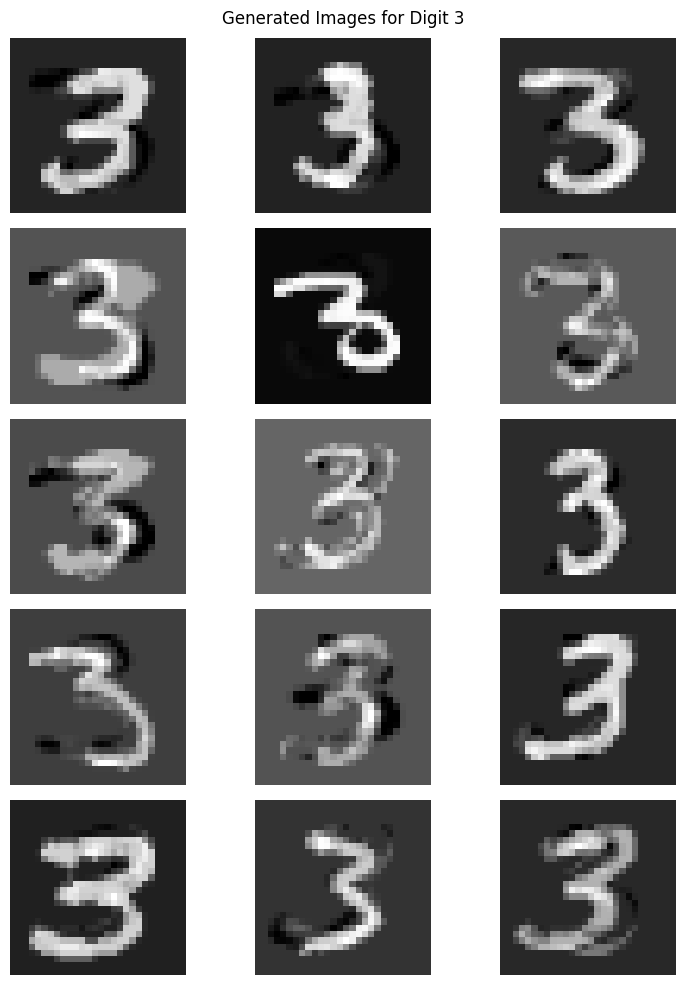
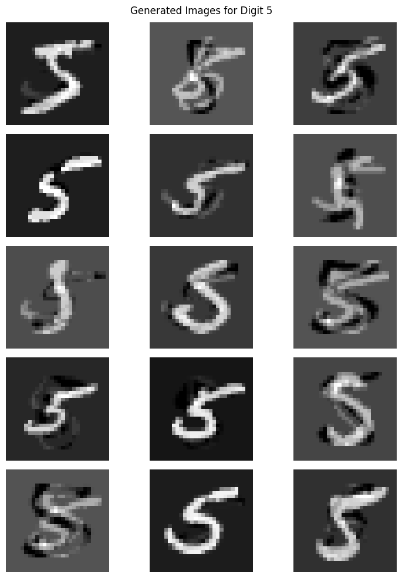

# Smote-Implementation-from-Scratch-for-Image-Generation

This project implements **SMOTE (Synthetic Minority Over-sampling Technique)** from scratch and applies it to the **MNIST handwritten digits dataset**. The goal is to generate synthetic samples for MNIST digits and visualize the generated images.

---

## 🔍 Project Overview

In many real-world scenarios, class imbalance causes performance issues in classification tasks. SMOTE is a popular technique that tackles this problem by generating new, synthetic examples in the minority class space.

This project focuses on:
- **Implementing K-Nearest Neighbors (KNN)** from scratch.
- **SMOTE interpolation** in high-dimensional space (784-pixel images).
- **Generating synthetic digit images** for visualization and experimentation.

---

## 🧪 Results & Insights

- 15 synthetic images for **digit 3** and **digit 5** were generated using SMOTE.
- SMOTE produces new samples by **linearly interpolating** between nearest neighbors in feature space.
- As expected, the generated images appear **blurry or intertwined** due to pixel-level blending rather than structural modeling.

### Figure: Digit 3 (Generated Samples)

### Figure: Digit 5 (Generated Samples)

> The ghost-like appearance is a natural consequence of SMOTE in pixel space.

---

## 🧠 Explanation: Why Images Look Blurry?

SMOTE performs linear interpolation of vectorized images. Each pixel is treated independently, so the generated samples often blend edges and strokes from multiple digits. This is expected and normal for pixel-space SMOTE.

---

## ✍️ Author

- **Syed Muhammad Mehran**
- Graduate Student, Data Science

---

